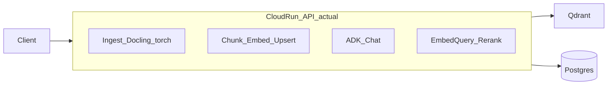
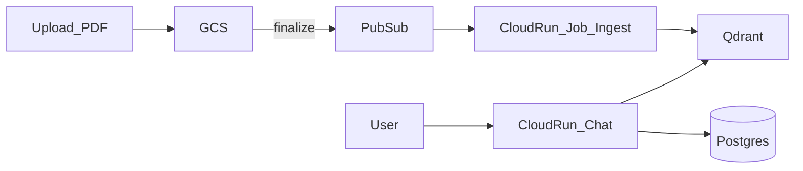

# Diseño: separar ingest/index de serving/chat

Documento vivo. Los ejes §3–§4 quedan como **contexto / alternativas**; el norte operativo está crowneado en §7.

Relacionado: [architecture-improvements.md](./architecture-improvements.md) §1.

---

## 1. Contexto y problema

### Estado actual

Un solo composition root en el `lifespan` de FastAPI
([`infrastructure/api/main.py`](../src/RAG_Agent/infrastructure/api/main.py)) construye en el mismo proceso:

- `NativePdfPipeline` (Docling + PyMuPDF + torch)
- chunker (`section` | `semantic` → sentence-transformers/torch si semantic)
- embedder (Cohere dense ± BM25 sparse vía fastembed)
- vector store (Qdrant)
- agente ADK + sessions + tool de búsqueda (embed query + rerank)

Una sola imagen ([`Dockerfile`](../Dockerfile)) instala el stack completo, precalienta BM25 en build, y el CMD arranca la API de producto (chat **e** ingest).

Localmente ([`docker-compose.yaml`](../docker-compose.yaml)) un servicio `agent-api` concentra todo; el Dev UI es otro entrypoint de la misma imagen.

### Dolores ya observados

- **OOM** en Cloud Run al arrancar el monolito (Docling/torch + embedders + agente).
- **Rate-limits HuggingFace** en cold start compartido (mitigado parcialmente pre-descargando BM25 en la imagen; el problema de fondo sigue: una imagen/proceso hace demasiado).
- **Ingest event-driven** (GCS → Pub/Sub → Cloud Run Job) encaja mal mientras parse/index viven en el mismo servicio HTTP que atiende chat: timeouts, memoria, escalado y ciclo de vida distintos.



### Objetivo de este diseño

Separar al menos dos **surfaces** de runtime/deploy, compartiendo domain + application, de forma que:

- el proceso de **chat** no cargue Docling/torch de ingest;
- el proceso de **ingest/index** pueda ser Job, API ops o CLI sin arrastrar ADK/sessions;
- quede abierta la puerta a bucket + Pub/Sub + Cloud Run Jobs sin forzar ya un único camino.

---

## 2. Surfaces y dependencias

| Capability | Ingest / index | Serving / chat |
|---|---|---|
| Docling / torch / PyMuPDF | sí | no |
| Semantic chunker (sentence-transformers) | sí si `chunker=semantic` | no |
| Dense embedder (Cohere) | `embed_doc` | `embed_query` |
| Sparse BM25 (fastembed) | sí (index hybrid) | sí (query hybrid) |
| Reranker (Cohere) | no | sí |
| ADK + LiteLLM + sessions | no | sí |
| Qdrant | upsert | search |

**Importante:** partir el proceso **no** elimina que chat siga necesitando embedder de query + (opcional) BM25 + reranker. Solo saca el pipeline PDF→CanonicalDocument→chunk del hot path de chat.

Use cases actuales (invariantes de producto):

| Use case | Surface natural |
|---|---|
| `IngestDocumentService` | ingest / index |
| `SearchDocumentsService` | serving (tool / retrieval) |
| `ChatService` / `ResetMemoryService` | serving |

---

## 3. Ejes de decisión (opciones en igualdad)

Los ejes son **independientes**: se pueden combinar. Ninguno está cerrado.

### Eje A — Boundary de proceso / deploy

| ID | Opción | Idea |
|---|---|---|
| A1 | Dos composition roots, **misma imagen** | p. ej. `main_chat` vs `main_ingest` / job entry; mismos layers Docker |
| A2 | Dos **imágenes**, mismo repo | `Dockerfile.serving` slim vs `Dockerfile.ingest` heavy |
| A3 | Tres surfaces | chat + retrieval API + ingest worker (aislar embed/rerank del agente) |

| | Pros | Contras |
|---|---|---|
| A1 | Cambio rápido; un build; compose simple | Imagen sigue gorda; riesgo de import accidental de Docling en chat |
| A2 | Chat cold start más ligero; límites de memoria distintos | Dos builds/CI; drift de versiones; más DX |
| A3 | Escala retrieval aparte; chat aún más fino | Complejidad operativa; latencia extra; suele ser prematuro |

### Eje B — Trigger de ingest

| ID | Opción | Idea |
|---|---|---|
| B1 | HTTP síncrono | `POST /ingest` como hoy (path local o montado) |
| B2 | CLI / script | Ya hay scripts de reindex/append en `scripts/` |
| B3 | Event-driven | GCS object finalize → Pub/Sub → Cloud Run Job |
| B4 | Híbrido | HTTP ops/dev + Job en prod |

| | Pros | Contras |
|---|---|---|
| B1 | Simple, sync, fácil de depurar | Timeouts HTTP; no escala con PDFs grandes; acopla API a CPU/GPU |
| B2 | Bueno para backfills / ops | No automático; no “llegó al bucket” |
| B3 | Encaje natural Cloud Run Jobs; memoria/CPU solo cuando hay doc; desacopla chat | IAM, DLQ, idempotencia, observabilidad; path ya no es “local file” |
| B4 | Flexibilidad | Dos caminos que mantener |

### Eje C — Destino de `POST /ingest` (abierto)

| ID | Opción | Idea |
|---|---|---|
| C1 | HTTP en **ingest service** separado | Ops/dev/manual; no vive en el proceso de chat |
| C2 | **Eliminar** del producto | Solo Job / CLI |
| C3 | Gateway que **encola** | `/ingest` publica a Pub/Sub; no parsea en el request |

| | Pros | Contras |
|---|---|---|
| C1 | DX familiar; curl/Postman; útil en local | Otro servicio HTTP que operar |
| C2 | Superficie mínima; un solo camino prod | Pierdes ingest interactivo vía API |
| C3 | API rápida; mismo backend que el Job | “Ingest accepted” ≠ “indexed”; hace falta status/idempotencia |

### Eje D — Packaging de dependencias Python

| ID | Opción | Idea |
|---|---|---|
| D1 | Un `pyproject` + **extras** (`serving` / `ingest`) | Imágenes instalan solo lo necesario |
| D2 | Dos packages en monorepo | Frontera dura de imports |
| D3 | Mismas deps; split solo de entrypoints | Mínimo cambio de packaging |

| | Pros | Contras |
|---|---|---|
| D1 | Equilibrio habitual en 2026 | Hay que disciplinarse con imports opcionales |
| D2 | Máxima claridad | Overhead de versionado/releases |
| D3 | Rápido para A1 | No reduce tamaño de imagen ni OOM por deps instaladas |

---

## 4. Escenarios de referencia

Combinaciones útiles para discutir. **No son una ranking final.**

### S1 — Dual entrypoint, misma imagen

- `RAG_Agent.infrastructure.api.main_chat` (o similar): chat + reset + search tool; **sin** `NativePdfPipeline`.
- `RAG_Agent.infrastructure.api.main_ingest` o entry de Job/CLI: solo `IngestDocumentService`.
- Compose: dos services, mismo `build`/Dockerfile.
- Encaje Jobs: el Job usa el entry ingest de la misma imagen.

**Pros:** poco refactor; desacopla procesos ya.  
**Contras:** imagen pesada; hay que vigilar imports en el entry de chat.  
**Mejor si:** quieres alivio operativo rápido sin tocar `pyproject`/CI a fondo.

### S2 — Dual image

- `Dockerfile.serving`: sin Docling/torch/sentence-transformers de chunking; CMD = chat API.
- `Dockerfile.ingest`: stack completo; CMD = Job o ingest API.
- Requiere Eje D1 o D2 para que el slim sea real.

**Pros:** chat más barato en memoria; límites Cloud Run distintos.  
**Contras:** dos pipelines de build; probar ambas imágenes.  
**Mejor si:** el cold start / memoria de chat es el dolor #1 y el Job puede ser más grande/lento.

### S3 — Event-driven Job (motivación prod)



- Chat: solo serving (A1 o A2).
- Ingest: Cloud Run Job ejecuta `IngestDocumentService(path, index=True)` tras bajar el objeto de GCS (o montar vía evento).
- `POST /ingest` en chat: no existe; destino de HTTP ops = C1/C2/C3 por decidir.

**Pros:** escala con documentos, no con usuarios de chat; timeouts de Job ≠ request HTTP.  
**Contras:** diseño de mensaje Pub/Sub, reintentos, DLQ, idempotencia por `doc_id`/hash, permisos GCS.  
**Mejor si:** el flujo real es “PDF llega al bucket”.

### S4 — HTTP enqueue + Job

- Un endpoint ligero (en chat gateway o ingest API) valida y **publica** a Pub/Sub; responde 202.
- El trabajo pesado es el mismo Job que en S3.

**Pros:** ops manual sin bloquear; mismo worker que el path GCS.  
**Contras:** hace falta correlacionar job status; no es “ingest sync” como hoy.  
**Mejor si:** quieres API de disparo y un solo motor de indexado.

### Lectura cruzada rápida

| Escenario | Alivia OOM chat | Encaja GCS→Job | DX local | Complejidad GCP |
|---|---|---|---|---|
| S1 | parcial (proceso) | sí (mismo entry job) | alta | baja |
| S2 | alta (imagen) | sí | media | media |
| S3 | alta (si + A1/A2) | nativo | media (emular eventos) | alta |
| S4 | alta (si + A1/A2) | nativo + API trigger | media | alta |

---

## 5. Invariantes del código actual

Lo que **no** debería reescribirse para lograr el split:

- Application: `IngestDocumentService`, `SearchDocumentsService`, `ChatService`, `ResetMemoryService`.
- Domain ports / VOs (`CanonicalDocument`, `SearchHit`, tools framework-agnostic).
- Split = **composition roots + deploy (+ packaging opcional)**, no nuevos use cases por transport.

Posible evolución de [`composition.py`](../src/RAG_Agent/infrastructure/composition.py) (opción de implementación, no decisión):

- `build_ingest_*` → parser, chunker, embedder doc, vector store upsert;
- `build_serving_*` → embedder query, vector store search, reranker, agent runtime;

sin que domain importe infrastructure.

Implicación para el contrato de ingest hoy (`path` en disco): el worker event-driven materializa el PDF (download GCS → temp path) y reutiliza `IngestDocumentService`; extender el puerto a URI remota es opcional.

---

## 6. Criterios de evaluación

Usar esta checklist al comparar opciones en siguientes iteraciones:

| Criterio | Pregunta |
|---|---|
| Memoria cold start chat | ¿Cabe en el límite Cloud Run sin Docling? |
| Tiempo / tamaño de build | ¿Una o dos imágenes? ¿Extras? |
| Coste ingest worker | ¿CPU/GPU solo cuando hay PDF? ¿Duración típica O-RAN? |
| DX local | ¿Compose sigue siendo `up` y listo? ¿Cómo se prueba el push Pub/Sub? |
| Idempotencia ingest | ¿Re-procesar el mismo objeto es seguro? |
| Observabilidad | ¿Logs/métricas por `doc_id` / message_id / session? |
| Complejidad GCP | IAM, Pub/Sub DLQ, Eventarc/notificación GCS, secretos |
| Rollback | ¿Se puede volver al monolito o a un solo entry temporalmente? |
| Acoplamiento de imports | ¿El entry chat puede importar Docling “por accidente”? |

---

## 7. Norte crowneado y preguntas abiertas

### 7.1 Arquitectura objetivo

Tres superficies potenciales; contrato estable = **PDF en GCS**. Ingest event-driven = **Cloud Run Service + Pub/Sub push** (como el patrón del otro proyecto), **no** Job obligatorio. Job queda reservado a scraper periódico o backfills.

```text
[Scraper Job] ──► GCS ──► Pub/Sub ──► [Ingest Service] ──► Qdrant
                 ▲                         │
         upload manual / ops               ▼
                                    Registro (Postgres)

[Chat Service] ──► Qdrant + Cohere query/rerank + ADK + Sessions
```

| Surface | Rol |
|---|---|
| **Chat** | Service slim: `/chat`, `/reset-memory`; sin Docling/torch de ingest |
| **Ingest** | Service heavy: envelope Pub/Sub → download GCS → temp → `IngestDocumentService(index=True)` → cleanup |
| **Scraper** (futuro) | Job + Scheduler: detecta docs en web, catálogo propio, solo escribe GCS |

**Deduplicación en dos capas** (no mezclar):

| Capa | Pregunta | Dónde |
|---|---|---|
| Scraper | ¿Ya vi esta URL/fuente? | BBDD catálogo del scraper |
| Ingest | ¿Ya indexé este contenido? | Registro Postgres (+ Qdrant) |

**Cerrado respecto a los ejes §3:**

| Tema | Decisión de trabajo |
|---|---|
| Boundary | Dos surfaces (chat + ingest); no tres (sin retrieval API aparte) |
| Trigger prod | GCS → Pub/Sub → Ingest **Service** |
| `/ingest` en chat | Fuera del proceso de chat |
| Scraper | Fuera del ingest; solo alimenta el bucket |
| Cloud Run Job para ingest | No necesario en el camino event-driven |

Los escenarios S1–S4 / ejes A–D siguen en el doc como mapa de alternativas, no como menú abierto de producto.

### 7.2 Preguntas abiertas (siguiente refinamiento)

| # | Pregunta | Estado | Notas |
|---|---|---|---|
| 1 | ¿**A2** (Dockerfile slim + extras D1) desde el día 1, o **A1** (misma imagen, dos entrypoints) como paso intermedio? | **Cerrada: A2** | Dos imágenes desde serving/ingest split (serving slim + ingest heavy). Ver §7.2.2 |
| 2 | ¿Registro de ingest en **Postgres ya**, o v1 solo Qdrant? | **Cerrada p/ serving/ingest split: R1 (sin BBDD docs)** | Interesante más adelante (PR GCP / ops). Ver §7.2.5 |
| 3 | ¿Campos mínimos del evento Pub/Sub (`bucket`, `object`, `generation`)? ¿Quién valida “solo PDF”? | Abierta (PR GCP) | |
| 4 | ¿Clave de idempotencia / política de re-ingest? | **Cerrada: delete-by-doc_id + upsert; doc_id=stem** | §7.2.4 |
| 5 | Ops manual / disparo local | **Cerrada: script local tipo worker** | §7.2.3 — sin `/ingest` HTTP en serving/ingest split |
| 6 | Local vs Pub/Sub | **Cerrada p/ serving/ingest split** | Path local; sin MinIO/Pub/Sub aún |
| 7 | Scraper | Abierta (futuro) | |
| 8 | Orden serving/ingest split vs GCP | **Cerrada: serving/ingest split** | §7.2.1 |
| 9 | Monolito + Dev UI | **Cerrada: opción 1** | §7.2.6 |

#### 7.2.1 Cómo se implementa serving/ingest split (sin romper hexagonal)

**Sí: se mantiene la arquitectura hexagonal.** El split es de **composition roots / procesos**, no de domain ni application.

```text
domain/          ← igual (ports, VOs, tools, prompts)
application/     ← igual (ChatService, IngestDocumentService, SearchDocumentsService, …)
infrastructure/
  api/main_chat.py      ← NUEVO entry: solo chat + reset + search tool
  api/main_ingest.py    ← NUEVO entry: solo ingest (path local por ahora)
  api/main.py           ← hoy monolito; se parte o se depreca
  composition.py        ← partir o parametrizar build_serving_* vs build_ingest_*
  agent/ …              ← solo lo importa main_chat
  ingestion/ …          ← solo lo importa main_ingest
```

| Capa | ¿Se reescribe? | Rol en serving/ingest split |
|---|---|---|
| `domain/` | No | Puertos y reglas intactos |
| `application/` | No (salvo detalles menores) | Mismos use cases; cada proceso instancia los que necesita |
| `infrastructure/` | Sí, entrypoints + composition | Dos roots que cablean adapters distintos |
| Deploy | Compose: 2 services | Misma imagen al inicio (A1) o slim/heavy (A2) — ver #1 |

Flujo local tras serving/ingest split:

```text
compose: agent-chat  → ChatService → ADK / Qdrant search / sessions
compose: agent-ingest → IngestDocumentService(path) → Docling → chunk → embed → Qdrant
```

Pub/Sub/GCS **no** entran en esta PR; el worker de ingest sigue recibiendo un `path` (como hoy `/ingest`). Más adelante el mismo `IngestDocumentService` se llama tras `download_to_filename`.

#### 7.2.2 Dos imágenes (A2) en serving/ingest split

Decisión: **serving slim** + **ingest heavy** desde la primera PR de split (no A1 intermedio).

Hexagonal intacta: las imágenes solo eligen **qué adapters/deps se instalan e importan** en cada composition root.

| Imagen | Entrypoint | Deps típicas | No incluye |
|---|---|---|---|
| `Dockerfile.serving` / target serving | `main_chat` | FastAPI, ADK, LiteLLM, qdrant-client, cohere, (bm25/fastembed si hybrid query) | Docling, torch, sentence-transformers de chunking |
| `Dockerfile.ingest` / target ingest | `main_ingest` | Docling, torch, pymupdf, chunkers, cohere embed doc, qdrant | ADK, sessions DB del agente |

Packaging (detalle de implementación a bajar en la PR):

- Preferible **un `pyproject` + extras** (`[project.optional-dependencies] serving` / `ingest`) o dependency-groups de uv, y cada Dockerfile hace `uv sync --extra …`.
- Dos packages en monorepo (D2) **no** hace falta para A2.

Compose local: dos services, dos `dockerfile`/`target`, mismos Qdrant/Postgres de red.

Riesgo a vigilar: que `main_chat` no importe ni transitivamente módulos de `ingestion/` (disciplina de imports + tests de “serving no carga Docling”).

#### 7.2.3 Disparo local de ingest (script = mismo worker)

Decisión serving/ingest split: **no** hace falta `POST /ingest` en esta fase.

Un script (p. ej. `scripts/ingest_local.py` o entry `python -m …`) que:

1. Recibe un **path local** a PDF (en lugar de envelope Pub/Sub).
2. Usa el **mismo composition root** que el futuro Cloud Run ingest (`build_ingest_*` → `IngestDocumentService`).
3. Opcionalmente escribe logs/estado como hará el worker.

Cuando llegue GCP, el handler Pub/Sub será:

```text
attributes → download GCS → temp path → misma función run_ingest(path) → cleanup
```

y el script local será:

```text
CLI path → run_ingest(path)
```

Misma función de aplicación; dos adapters de entrada. Hexagonal: el script/HTTP/Pub/Sub viven en infrastructure; no se duplica lógica de parse/chunk/embed.

`/ingest` HTTP queda fuera de serving/ingest split (se puede reconsiderar en la PR GCP como ops enqueue, no como path sync en chat).

#### 7.2.4 Re-ingest: delete-by-`doc_id` + upsert

Política: al indexar un documento, **eliminar** en Qdrant todos los points con ese `doc_id` y luego upsert del set nuevo.

Así un cambio de chunker/settings no deja chunks huérfanos. Aplica igual en Qdrant local y Cloud (solo cambia `QDRANT_URL`).

**`doc_id` = stem del `source_path`** (como hoy en SectionChunker / SemanticChunker). Ej.: `O-RAN.WG1.TS.Use-Cases-Detailed-Specification-R005-v19.00`.

Implícito en serving/ingest split: el puerto `VectorStore` (o el use case) necesita una operación `delete_by_doc_id` antes del upsert — hoy puede no existir aún; entra en el alcance de implementación del split/ingest script.

#### 7.2.5 Registro de documentos (BBDD)

**serving/ingest split:** sin tabla SQL de documentos (R1). Estado = Qdrant + logs del script.

**Futuro (explícitamente deseable):** tabla `documents` (status, timestamps, errores, `doc_id`, source URI) para ops, Pub/Sub reintentos y scraper — sin bloquear el split.

#### 7.2.6 API chat, Dev UI e imagen serving

- **API producto (`main_chat`):** `/chat`, `/reset-memory` — **sin** `/ingest`.
- **Dev UI:** solo agente (ADK web); misma imagen **serving**, otro CMD en compose (`profile: dev`).
- **Ingest:** imagen heavy + script `run_ingest(path)`; no forma parte de la API de chat.
- El monolito actual (`main.py` con chat+ingest) **deja de ser** el entry de producto (se parte / sustituye; sin alias legacy).

```text
Dockerfile.serving  →  service agent-chat (main_chat)
                    →  service agent-dev-ui (dev_ui)   [profile dev]
Dockerfile.ingest   →  script / futuro worker
```

### 7.4 Evolución futura (Fan-Out / Fan-In) — no es el MVP

Arquitectura event-driven más ambiciosa (splitter → Cloud Tasks → workers Docling → aggregator → indexer), **totalmente desacoplada de ADK**. Válida como destino de escala; **no** sustituye §7.1 como primer objetivo.

```text
[1. UPLOAD]     [2. FAN-OUT]                    [3. FAN-IN]         [4. INDEXING]
 PDF            ┌─► Docling worker (págs N) ──┐
  │             │                             │
 GCS raw → Splitter ─► Cloud Tasks ─► ... ──► Aggregator → GCS canonical → Indexer → Qdrant
                │                             │
                └─► Docling worker (págs M) ──┘
```

Hoy el repo ya hace un Fan-Out/Fan-In **in-process**: `NativePdfPipeline` trocea por shards → Docling por trozo → `merge_canonical_shards`. Sacar eso a microservicios + Cloud Tasks solo compensa cuando un solo worker (con ese sharding) no baste en tiempo/memoria/paralelismo.

**Principios a adoptar pronto** (sin montar los 4 servicios):

| Principio | Por qué |
|---|---|
| Persistir JSON canónico (GCS u otro) | Re-index / cambio de embedder sin re-Docling |
| Registro de estado en BBDD | `PROCESSING` → `CANONICALIZED` → `INDEXED` |
| Upsert Qdrant con IDs deterministas | Idempotencia ante reintentos |
| Rate limit / batching Cohere | Ya es un dolor real; tenacity + límites de cola después |

**Camino incremental** (no saltar al Fan-Out distribuido):

| Paso | Qué | Cuándo |
|---|---|---|
| 0 | Norte §7.1: chat ⊥ ingest Service; GCS → Pub/Sub → un worker (`IngestDocumentService`) | Ahora |
| 1 | Mismo worker, fases internas: parse → canonical en GCS → chunk/embed/upsert | Cuando duela re-indexar o depurar parse |
| 2 | Fan-Out distribuido (splitter + workers Docling + aggregator) | Solo si Docling no cabe en un run |
| 3 | `04_indexer` como Service aparte disparado por `canonical/` | Opcional; re-index sin Docling |

Regla: **desacoplar ADK del ingest primero; persistir canonical y registro; paralelizar Docling en la red solo cuando el sharding in-process no baste.**

### 7.5 Log de refinamiento

| Fecha | Cambio |
|---|---|
| 2026-07-29 | Creación: ejes A–D, escenarios S1–S4; sin crownear |
| 2026-07-29 | Crownear norte §7.1 (chat slim + ingest Service + GCS/Pub/Sub; scraper futuro; dual dedup). Sustituir decisiones abiertas por preguntas §7.2 |
| 2026-07-29 | Añadir §7.4: Fan-Out/Fan-In como evolución futura, no MVP; principios y pasos 0→3 |
| 2026-07-29 | #8=serving/ingest split; §7.2.1 cómo implementar sin romper hexagonal; #6 path local para serving/ingest split |
| 2026-07-29 | #1=A2 dos imágenes; §7.2.2 |
| 2026-07-29 | #5=script local que imita worker (path vs Pub/Sub); §7.2.3; sin HTTP /ingest en serving/ingest split |
| 2026-07-29 | #4=delete-by-doc_id + upsert (§7.2.4); doc_id=stem (D1) |
| 2026-07-29 | #2=R1 sin BBDD docs en serving/ingest split; registro SQL futuro (§7.2.5) |
| 2026-07-29 | #9=main_chat sin ingest + Dev UI en imagen serving; monolito fuera (§7.2.6) |
| 2026-07-29 | §9 checklist implementación serving/ingest split + foto final carpetas/hexagonal |
| 2026-07-30 | **serving/ingest split merged to main** ([serving-ingest-split.md](./serving-ingest-split.md)): `main_chat` + `composition/{serving,ingest,shared}`; `delete_by_doc_id` + idempotent ingest; `ingest_local.py`; `Dockerfile.serving` / `Dockerfile.ingest`; uv groups; opencv-headless; import guardrail; README. Compose service stays `agent-api`. Next: GCP Pub/Sub/GCS worker. |

---

## 8. Fuera de alcance (de este doc / de serving/ingest split)

**Fuera de serving/ingest split (PR posteriores):**

- GCS + Pub/Sub + download en worker (§7.2 #3).
- Registro SQL de documentos (§7.2.5 futuro).
- Scraper (§7.2 #7).
- Fan-Out/Fan-In distribuido (§7.4 pasos 2–3).
- Adapter explícito `SessionStore` ↔ ADK ([architecture-improvements.md](./architecture-improvements.md) §2).
- Enriquecer dominio de agente (§3 de architecture-improvements).

**Decisiones serving/ingest split ya cerradas** — la implementación puede empezar (§9).

---

## 9. Checklist de implementación — serving/ingest split

Objetivo de esta oleada: **partir el monolito en dos imágenes/procesos**, mantener hexagonal, poder chatear en slim e ingerir con script local. **Sin GCP.**

### 9.1 Foto final (cómo queda todo)

```text
                    ┌─────────────────────────────────────┐
                    │         domain/  application/         │
                    │  (compartido, sin deps de infra)      │
                    └───────────────┬─────────────────────┘
                                    │ ports
              ┌─────────────────────┴─────────────────────┐
              ▼                                           ▼
┌──────────────────────────┐              ┌──────────────────────────┐
│  IMAGEN SERVING (slim)   │              │  IMAGEN INGEST (heavy)   │
│  main_chat + dev_ui      │              │  run_ingest(path)        │
│  ADK, sessions, search   │              │  Docling, chunk, embed  │
│  embed_query + rerank    │              │  delete_by_doc_id+upsert │
└────────────┬─────────────┘              └────────────┬─────────────┘
             │                                           │
             └──────────────► Qdrant ◄───────────────────┘
             └──────────────► Postgres sessions (solo chat)
```

**Compose local (ejemplo):**

| Service | Imagen | Comando | Puertos |
|---|---|---|---|
| `agent-chat` | serving | `main_chat` / fastapi | 8000→8080 |
| `agent-dev-ui` | serving | `dev_ui` | 8080 (profile `dev`) |
| — | ingest | `uv run scripts/ingest_local.py path.pdf` (one-shot o service opcional) | — |
| `qdrant` / `postgres` | como hoy | — | — |

### 9.2 Organización de carpetas (propuesta)

Hexagonal **igual**; solo se reorganizan entrypoints y composition. No hace falta un segundo package Python.

```text
src/RAG_Agent/
├── domain/                          # SIN CAMBIOS de diseño
│   ├── ports/                       # + delete_by_doc_id en VectorStore
│   ├── value_objects/
│   ├── tools/
│   ├── prompts/
│   └── agents/
├── application/                     # SIN CAMBIOS de diseño
│   ├── chat_service/
│   ├── reset_memory_service/
│   ├── search_documents_service/
│   └── ingest_documents_service/    # execute: delete_by_doc_id luego upsert
├── infrastructure/
│   ├── composition/
│   │   ├── serving.py               # build_search, embedder query, reranker, sessions, agent
│   │   └── ingest.py                # build parser, chunker, embedder doc, vector_store
│   │   # (alternativa: un composition.py con secciones claras serving vs ingest)
│   ├── api/
│   │   ├── main_chat.py             # lifespan solo chat/reset; SIN ingest
│   │   ├── models.py                # sin Ingest* o movidos si algún día hay HTTP ingest
│   │   └── main.py                  # ELIMINAR o reducir a reexport temporal → preferir eliminar
│   ├── agent/                       # solo lo usa serving
│   │   ├── adk_runtime.py
│   │   ├── sessions.py
│   │   ├── lite_llm.py
│   │   ├── dev_ui.py
│   │   └── dev_agents/...
│   ├── ingestion/                   # solo lo usa ingest (no importar desde main_chat)
│   └── indexing/                    # split de uso: search en serving; chunk/embed_doc en ingest
│       # CohereEmbedder / HybridEmbedder / Qdrant usados por ambas imágenes
│       # SemanticChunker / Docling solo en imagen ingest
├── config.py
scripts/
└── ingest_local.py                  # CLI → run_ingest(path); mismo root que futuro worker
Dockerfile.serving
Dockerfile.ingest
docker-compose.yaml                  # agent-chat + (dev-ui) + qdrant + postgres
```

**Regla de imports (crítica para imagen slim):**

- `main_chat` / `composition.serving` **no** importan `infrastructure.ingestion` ni chunkers Docling/torch.
- Tests: smoke “import main_chat no tira de docling”.

### 9.3 Capas hexagonales tras serving/ingest split

| Capa | Responsabilidad | ¿Quién la carga? |
|---|---|---|
| **domain** | Ports, VOs, tool factory, prompts | Ambas (código); deps runtime distintas |
| **application** | Use cases | Serving: Chat/Search/Reset · Ingest: IngestDocument |
| **infrastructure** | Adapters | Solo los del entrypoint correspondiente |
| **composition root** | Wire deps | `serving.py` vs `ingest.py` (o equivalente) |
| **drivers** | HTTP / CLI / (futuro Pub/Sub) | `main_chat`, `dev_ui`, `ingest_local.py` |

El use case no sabe si el PDF vino de disco local o de GCS.

### 9.4 Pasos de implementación (con contexto)

Orden recomendado; cada paso es verificable.

#### Paso A — Puerto `delete_by_doc_id`

**Por qué:** Política §7.2.4; sin esto el re-ingest deja basura al cambiar chunking.

**Qué hacer:**

- Añadir `delete_by_doc_id(doc_id: str) -> int` a `domain/ports/vector_store.py`.
- Implementar en `QdrantVectorStore` (filtro por payload `doc_id`).
- Tests unitarios con cliente fake / in-memory si ya lo usáis.

**No hace:** BBDD de registro.

#### Paso B — `IngestDocumentService` idempotente

**Por qué:** Un solo sitio decide “limpiar + indexar”.

**Qué hacer:**

- En `execute(..., index=True)`: obtener `doc_id` (stem, alineado con chunkers) → `vector_store.delete_by_doc_id` → chunk → embed → upsert.
- Mantener `index=False` = solo parse (útil para depurar canonical).

**Contexto:** El script local y el futuro Pub/Sub solo llaman a este use case.

#### Paso C — Partir composition

**Por qué:** Hoy `composition.py` + `main.py` lifespan construyen parser+agente juntos.

**Qué hacer:**

- `build_serving_*`: embedder (query), vector_store, reranker, search_service, session, adk runtime + tool.
- `build_ingest_*`: NativePdfPipeline, chunker, embedder (doc), vector_store.
- Evitar que `build_serving` importe módulos que carguen Docling/torch al importar.

**Contexto:** Esto es el corazón del split hexagonal sin tocar domain.

#### Paso D — `main_chat.py` (API sin ingest)

**Por qué:** API de producto = solo agente.

**Qué hacer:**

- Nuevo entrypoint lifespan: chat + reset + search tool.
- Quitar rutas `/ingest` y modelos de ingest de esta app (o dejar de importarlos).
- Actualizar tests `test_api_chat` / quitar o mover tests de ingest API.
- Eliminar (preferido) el monolito `main.py` que mezcla ambos.

**Contexto:** Cloud Run prod apuntará a este módulo; local compose también.

#### Paso E — Script `ingest_local.py`

**Por qué:** Mimic del worker Cloud Run con path en vez de Pub/Sub (§7.2.3).

**Qué hacer:**

- CLI: path al PDF, flag `index` (default true).
- Composition ingest → `IngestDocumentService.execute`.
- Logs claros (doc_id, chunk_count).
- Deprecar o redirigir `scripts/index_pdf_append.py` / `reindex_tr_section.py` hacia este root si aplica (sin shims eternos; migrar callers).

**Contexto:** En compose no hace falta un servicio HTTP ingest; `docker compose run ingest-tools …` o `uv run` en el host contra Qdrant del compose.

#### Paso F — Packaging: extras + dos Dockerfiles

**Por qué:** A2 — chat no debe *instalar* Docling/torch.

**Qué hacer:**

- En `pyproject.toml`: dependencias base + optional-dependencies / dependency-groups `serving` e `ingest` (repartir: ADK/sessions en serving; docling/torch/pymupdf/sentence-transformers en ingest; cohere/qdrant/fastembed donde haga falta en ambos).
- `Dockerfile.serving`: `uv sync --extra serving` (o group), CMD `main_chat`.
- `Dockerfile.ingest`: `uv sync --extra ingest`, sin CMD de API chat (o CMD default al script help).
- Pre-download BM25 solo en la imagen que lo necesite en runtime (si hybrid query en serving, ahí; si solo index, en ingest — hoy hybrid afecta a ambos: embedding query sparse en chat → BM25 en **serving** también).

**Contexto:** Revisar con cuidado BM25: si `qdrant_enable_sparse=True`, **serving** necesita sparse embedder de query. Eso no es Docling, pero sí fastembed en la imagen slim.

#### Paso G — `docker-compose.yaml`

**Por qué:** DX local alineada al norte.

**Qué hacer:**

- `agent-chat` build `Dockerfile.serving`.
- `agent-dev-ui` misma imagen, command `dev_ui`, profile `dev`.
- Quitar ingest del servicio chat; documentar cómo lanzar `ingest_local`.
- Misma red Qdrant/Postgres.

#### Paso H — Tests y guardrails

**Por qué:** Evitar regresiones y que alguien reimporte Docling en chat.

**Qué hacer:**

- Tests `delete_by_doc_id` + ingest idempotente (fake vector store).
- Test/smoke: importar `main_chat` no importa `docling` / `NativePdfPipeline`.
- Ajustar tests API que asumían `/ingest` en la misma app.
- CI: build de ambas imágenes (al menos serving) si el pipeline lo permite.

#### Paso I — Documentación corta

**Por qué:** El equipo (y tú en dos semanas) sabe cómo arrancar.

**Qué hacer:**

- README o doc ops: `compose up` chat; `ingest_local.py ruta.pdf`; profile dev UI.
- Actualizar este doc §7.5 log cuando se mergee.

### 9.5 Criterio de “serving/ingest split hecho”

- [x] `POST /ingest` ya no existe en la API de chat.
- [x] Dos Dockerfiles; imagen serving sin Docling/torch.
- [x] Dev UI arranca desde imagen serving.
- [x] Script local indexa contra Qdrant compose con delete+upsert por stem.
- [x] Domain/application sin depender de GCP ni de un monolito.
- [x] Tests verdes; guardrail de imports serving.

### 9.6 Qué viene después (no mezclar)

1. PR GCP: Pub/Sub handler → download → `run_ingest(path)`.
2. Registro SQL opcional.
3. Canonical persistido (§7.4 paso 1).
4. Fan-out solo si hace falta.

---

## Próximos pasos (proceso)

1. ~~Cerrar preguntas serving/ingest split~~ — hecho (§7.2).
2. ~~Ejecutar checklist §9~~ — merged 2026-07-30 ([serving-ingest-split.md](./serving-ingest-split.md)).
3. Contrato Pub/Sub (#3) cuando se abra la oleada GCP.
4. No planificar Cloud Tasks / aggregator hasta validar worker único.
